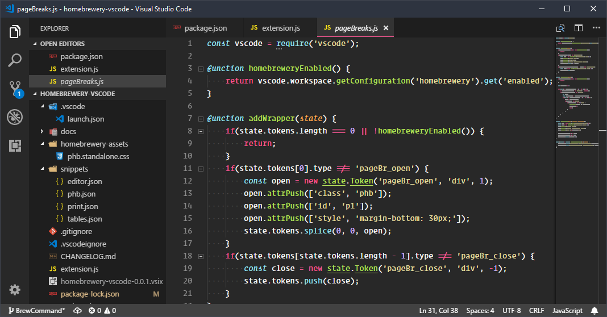

# Alloy Theme

A more monochromatic, desaturated Monokai theme.

## Install

press `ctl/command + shift + p` to launch the command palette then run
```
ext install alloy-theme
```

## Screenshot


## Changelog
You can take a look at the change log [here](CHANGELOG.md)