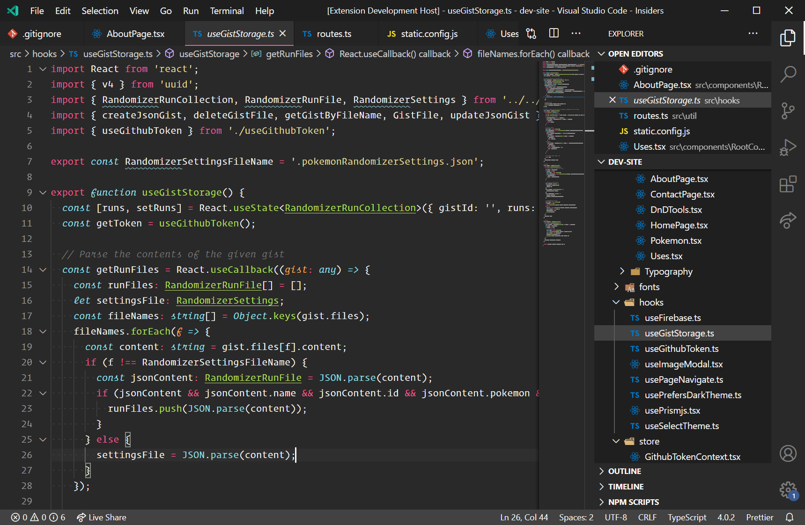

# Alloy Theme

A more monochromatic, desaturated Monokai theme. Also available for [prismjs](https://github.com/OfficerHalf/alloy-theme-prismjs), [Cmder (ConEmu)](https://gist.github.com/OfficerHalf/15e58676b29dfde1a85a2945799e66b4), and [Windows Terminal](https://gist.github.com/OfficerHalf/6b0b0803b5788aeb185415285b2c34c3).

## Install

press `ctl/command + shift + p` to launch the command palette then run
```
ext install alloy-theme
```

## Screenshot


## Changelog
You can take a look at the change log [here](CHANGELOG.md)
